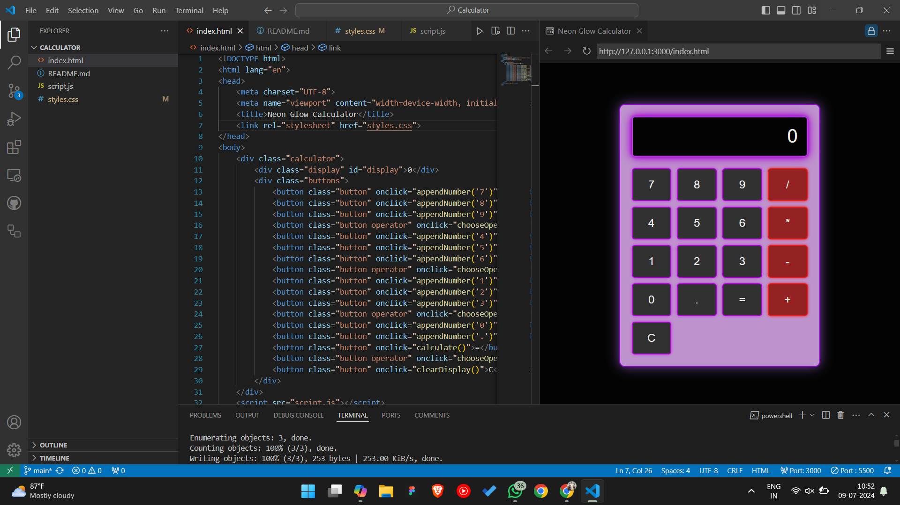
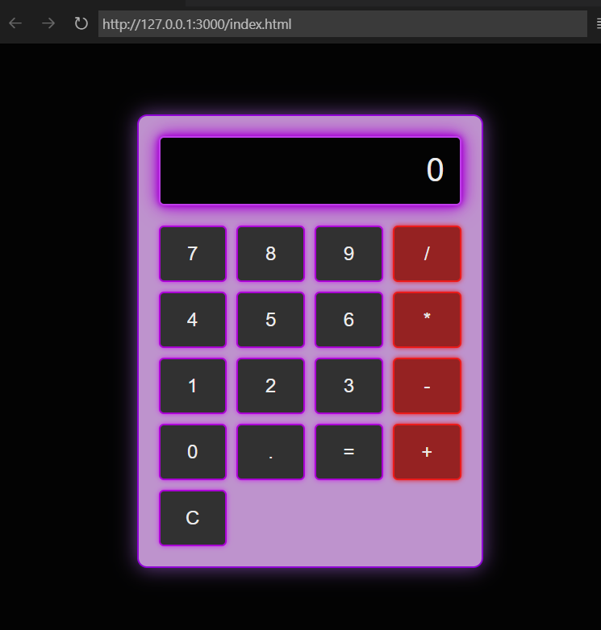

# Calculator-JS

### index.html:
```html :

<!DOCTYPE html>
<html lang="en">
<head>
    <meta charset="UTF-8">
    <meta name="viewport" content="width=device-width, initial-scale=1.0">
    <title>Neon Glow Calculator</title>
    <link rel="stylesheet" href="styles.css">
</head>
<body>
    <div class="calculator">
        <div class="display" id="display">0</div>
        <div class="buttons">
            <button class="button" onclick="appendNumber('7')">7</button>
            <button class="button" onclick="appendNumber('8')">8</button>
            <button class="button" onclick="appendNumber('9')">9</button>
            <button class="button operator" onclick="chooseOperation('/')">/</button>
            <button class="button" onclick="appendNumber('4')">4</button>
            <button class="button" onclick="appendNumber('5')">5</button>
            <button class="button" onclick="appendNumber('6')">6</button>
            <button class="button operator" onclick="chooseOperation('*')">*</button>
            <button class="button" onclick="appendNumber('1')">1</button>
            <button class="button" onclick="appendNumber('2')">2</button>
            <button class="button" onclick="appendNumber('3')">3</button>
            <button class="button operator" onclick="chooseOperation('-')">-</button>
            <button class="button" onclick="appendNumber('0')">0</button>
            <button class="button" onclick="appendNumber('.')">.</button>
            <button class="button" onclick="calculate()">=</button>
            <button class="button operator" onclick="chooseOperation('+')">+</button>
            <button class="button" onclick="clearDisplay()">C</button>
        </div>
    </div>
    <script src="script.js"></script>
</body>
</html>

```

### styles.css:

```css
body {
    display: flex;
    justify-content: center;
    align-items: center;
    height: 100vh;
    background-color: #000;
    margin: 0;
    font-family: 'Arial', sans-serif;
}

.calculator {
    text-align: center;
    background: #ce9ede;
    padding: 20px;
    border-radius: 10px;
    border: 2px solid #9900e6;
    box-shadow: 0 0 20px #7947a2;
    width: 300px;  /* Medium size width */
}

.display {
    font-size: 2em;
    background: #000;
    color: #fff;
    padding: 15px;
    border-radius: 5px;
    margin-bottom: 20px;
    text-align: right;
    border: 2px solid #d041ff;
    box-shadow: 0 0 5px #b400e6, 0 0 10px #b000e6, 0 0 20px #bc00e6;
}

.buttons {
    display: grid;
    grid-template-columns: repeat(4, 1fr);
    gap: 10px;
}

.button {
    font-size: 1.2em;
    padding: 15px;
    border: none;
    border-radius: 5px;
    background-color: #333;
    color: #fff;
    cursor: pointer;
    transition: background-color 0.3s;
    border: 2px solid #b800e6;
    box-shadow: 0 0 5px #db25ff;
}

.button:hover {
    background-color: #78b580;
}

.operator {
    background-color: #a02222;
    border: 2px solid #ff1a1a;
    box-shadow: 0 0 5px #ff1a1a;
}

.operator:hover {
    background-color: #cc0000;
}

.button.operator:hover {
    background-color: #ff3333;
}


```

### script.js:

```js
let displayValue = '';
let firstOperand = null;
let secondOperand = null;
let currentOperation = null;

function appendNumber(number) {
    if (displayValue.includes('.') && number === '.') return;
    displayValue += number;
    updateDisplay();
}

function chooseOperation(operation) {
    if (displayValue === '') return;
    if (firstOperand === null) {
        firstOperand = parseFloat(displayValue);
    } else {
        secondOperand = parseFloat(displayValue);
        calculate();
        firstOperand = parseFloat(displayValue);
    }
    currentOperation = operation;
    displayValue = firstOperand + operation;
    updateDisplay();
}

function calculate() {
    if (firstOperand === null || currentOperation === null || displayValue === '') return;
    const operationIndex = displayValue.indexOf(currentOperation);
    secondOperand = parseFloat(displayValue.slice(operationIndex + 1));
    let result;
    switch (currentOperation) {
        case '+':
            result = firstOperand + secondOperand;
            break;
        case '-':
            result = firstOperand - secondOperand;
            break;
        case '*':
            result = firstOperand * secondOperand;
            break;
        case '/':
            result = firstOperand / secondOperand;
            break;
        default:
            return;
    }
    displayValue = result.toString();
    firstOperand = null;
    secondOperand = null;
    currentOperation = null;
    updateDisplay();
}

function clearDisplay() {
    displayValue = '';
    firstOperand = null;
    secondOperand = null;
    currentOperation = null;
    updateDisplay();
}

function updateDisplay() {
    document.getElementById('display').textContent = displayValue || '0';
}

```
### Output:


